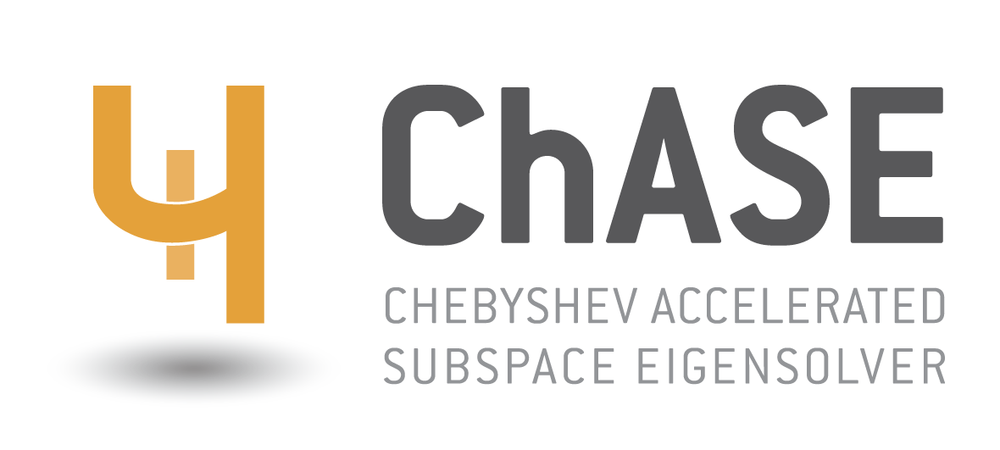

[](https://github.com/ChASE-library/ChASE/blob/master/LICENSE) [](https://zenodo.org/badge/latestdoi/349075288) [](https://github.com/ChASE-library/ChASE/releases/latest) [](https://doi.org/10.1145/3313828)


# ChASE: a Chebyshev Accelerated Subspace Eigensolver for Dense Eigenproblems

The **Ch**ebyshev **A**ccelerated **S**ubspace **E**igensolver (ChASE) is a modern and scalable library based on subspace iteration with polynomial acceleration to solve dense Hermitian (Symmetric) algebraic eigenvalue problems, especially solving dense Hermitian eigenproblems arragend in a sequence. Novel to ChASE is the computation of the spectral estimates that enter in the filter and an optimization of the polynomial degree that further reduces the necessary floating-point operations. 

ChASE is written in C++ using the modern software engineering concepts that favor a simple integration in application codes and a straightforward portability over heterogeneous platforms. When solving sequences of Hermitian eigenproblems for a portion of their extremal spectrum, ChASE greatly benefits from the sequence’s spectral properties and outperforms direct solvers in many scenarios. The library ships with two distinct parallelization schemes, supports execution over distributed GPUs, and is easily extensible to other parallel computing architectures.

## Use Case and Features

- **Real and Complex:** ChASE is templated for real and complex numbers. So it can be used to solve *real symmetric* eigenproblems as well as *complex Hermitian* ones.
- **Eigespectrum:** ChASE algorithm is designed to solve for the *extremal portion* of the eigenspectrum of matrix `A`. The library is particularly efficient when no more than `20%` of the extremal portion of the eigenspectrum is sought after. For larger fractions the subspace iteration algorithm may struggle to be competitive. Converge could become an issue for fractions close to or larger than `50%`.
- **Type of Problem:** ChASE can currently handle only standard eigenvalue problems. 
- **Sequences:** ChASE is particularly efficient when dealing with *sequences of eigenvalue problems*, where the eigenvectors solving for one problem can be use as input to accelerate the solution of the next one.
- **Vectors input:** Since it is based on subspace iteration, ChASE can receive as input a matrix of vector equal to the number of desired eigenvalues. ChASE can experience substantial speed-ups when this input matrix contains some information about the sought after eigenvectors.
- **Degree optimization:** For a fixed accuracy level, ChASE can optimize the degree of the Chebyshev polynomial filter so as to minimize the number of FLOPs necessary to reach convergence.
- **Precision:** ChASE is also templated to work in *Single Precision* (SP) or *Double Precision* (DP).

## Versions of the library

The library comes in two main versions: 

1. **ChASE-MPI**

   ChASE-MPI is the default version of the library and can be installed with the minimum amount of dependencies (BLAS, LAPACK, and MPI).  It supports different configurations depending on the available hardware resources.

   - **Shared memory build:** This is the simplest configuration and should be exclusively selected when ChASE is used on only one computing node or on a single CPU. 
   - **MPI+Threads build:** On multi-core homogeneous CPU clusters, ChASE is best used in its pure MPI build. In this configuration, ChASE is typically used with one MPI rank per NUMA domain and as many threads as number of available cores per NUMA domain.
   - **GPU build:** ChASE-MPI can be configured to take advantage of GPUs on heterogeneous computing clusters. Currently we support the use of one or more GPU cards per computing node in a number of flexible configurations: for instance on computing nodes with 4 cards per node one can choose to compile and execute the program with one, two or four GPU card per MPI rank.
   
   ChASE-MPI support two types of data distribution of matrix `A` across 2D MPI grid:

   - **Block Distribution**:  each MPI rank of 2D grid is assigned a block of dense matrix **A**.

   - **Block-Cyclic Distribution**: an distribution scheme for implementation of dense matrix computations on distributed-memory machines, to improve the load balance of matrix computation if the amount of work differs for different entries of a matrix. For more details, please refer to [Netlib](https://www.netlib.org/scalapack/slug/node75.html) .

2. **ChASE-Elemental**

   ChASE-Elemental requires the additional installation of the [Elemental](https://github.com/elemental/Elemental) library.

## Quick Start

### Installing Dependencies

```bash
#Linux Operating System
sudo apt-get install cmake #install CMake
sudo apt-get install build-essential #install GNU Compiler
sudo apt-get install libopenblas-dev #install BLAS and LAPACK
sudo apt-get install libopenmpi-dev #install MPI

#Apple Mac Operating System 
sudo port install cmake #install CMake
sudo port install gcc10 #install GNU Compiler
sudo port select --set gcc mp-gcc10 #Set installed GCC as C compiler
sudo port install OpenBLAS +native #install BLAS and LAPACK
sudo port install openmpi #install MPI
sudo port select --set mpi openmpi-mp-fortran #Set installed MPI as MPI compiler
```

### Cloning ChASE source code

```bash
git clone https://github.com/ChASE-library/ChASE #cloning the ChASE repository
git checkout v1.0.0 #it is recommended to check out the latest stable tag.
```

### Building and Installing the ChASE library

```bash
cd ChASE/
mkdir build
cd build/
cmake .. -DCMAKE_INSTALL_PREFIX=${ChASEROOT}
make install
```

More details about the installation on both local machine and clusters, please refer to [User Documentation](https://chase-library.github.io/ChASE/quick-start.html).

## Documentation

The documentation of ChASE is available [online](https://chase-library.github.io/ChASE/index.html).

Compiling the documentation in local requires  enable `-DBUILD_WITH_DOCS=ON` flag when compiling ChASE library:

```bash
cmake .. -DBUILD_WITH_DOCS=ON
```

## Examples

Multiple examples are provided, which helps user get familiar with ChASE. 

**Build ChASE with Examples** requires enable `-DBUILD_WITH_EXAMPLES=ON` flag when compiling ChASE library:

```bash
cmake .. -DBUILD_WITH_EXAMPLES=ON
```

**5 examples are available** in folder [examples](https://github.com/ChASE-library/ChASE/tree/master/examples):

0. The example [0_hello_world](https://github.com/ChASE-library/ChASE/tree/master/examples/0_hello_world) constructs a simple Clement matrix and find a given number of its eigenpairs.

1. The example [1_sequence_eigenproblems](https://github.com/ChASE-library/ChASE/tree/master/examples/1_sequence_eigenproblems) illustrates how ChASE can be used to solve a sequence of eigenproblems.
2. The example [2_input_output](https://github.com/ChASE-library/ChASE/tree/master/examples/2_input_output) provides the configuration of parameters of ChASE from command line (supported by Boost); the parallel I/O which loads the local matrices into the computing nodes in parallel.
3. The example [3_installation](https://github.com/ChASE-library/ChASE/tree/master/examples/3_installation) shows the way to link ChASE to other applications.
4. The example [4_gev](https://github.com/ChASE-library/ChASE/tree/master/examples/4_gev) shows an example to solve Generalized Eigenproblem via the Cholesky Factorization provided by ScaLAPACK.

## Developers

### Main developers

- Edoardo Di Napoli – Algorithm design and development
- Xinzhe Wu – Algorithm development, advanced parallel implementation, developer documentation
- Davor Davidovic – Advanced parallel GPU implementation and optimization

### Current contributors

- Xiao Zhang – Integration of ChASE into Jena BSE code
- Miriam Hinzen, Daniel Wortmann – Integration of ChASE into FLEUR code
- Sebastian Achilles – Library benchmarking on parallel platforms, documentation

### Past contributors

- Jan Winkelmann – DoS algorithm development and advanced `C++` implementation
- Paul Springer – Advanced GPU implementation
- Marija Kranjcevic – OpenMP `C++` implementation
- Josip Zubrinic – Early GPU algorithm development and implementation
- Jens Rene Suckert – Lanczos algorithm and GPU implementation
- Mario Berljafa – Early `C` and `MPI` implementation using the Elemental library


## Contribution

This repository mirrors the principal Gitlab repository. If you want to contribute as developer to this project please contact e.di.napoli@fz-juelich.de.

## How to Cite the Code

The main reference of ChASE is [1] while [2] provides some early results on scalability and usage on sequences of eigenproblems generated by Materials Science applications.

- [1] J. Winkelmann, P. Springer, and E. Di Napoli. *ChASE: a Chebyshev Accelerated Subspace iteration Eigensolver for sequences of Hermitian eigenvalue problems.* ACM Transaction on Mathematical Software, **45** Num.2, Art.21, (2019). [DOI:10.1145/3313828](https://doi.org/10.1145/3313828) , [[arXiv:1805.10121](https://arxiv.org/abs/1805.10121/) ]
- [2] M. Berljafa, D. Wortmann, and E. Di Napoli. *An Optimized and Scalable Eigensolver for Sequences of Eigenvalue Problems.* Concurrency & Computation: Practice and Experience **27** (2015), pp. 905-922. [DOI:10.1002/cpe.3394](https://onlinelibrary.wiley.com/doi/pdf/10.1002/cpe.3394) , [[arXiv:1404.4161](https://arxiv.org/abs/1404.4161) ].

## Copyright and License

[3-Clause BSD License (BSD License 2.0)](https://github.com/ChASE-library/ChASE/blob/master/LICENSE)

